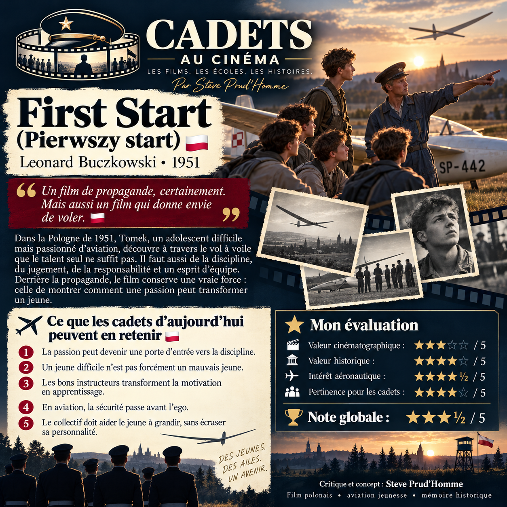

# 🇵🇱 CADETS AU CINÉMA — First Start (*Pierwszy start*), 1951

**Une critique de Steve Prud’Homme — Note : 3,5 / 5**

[Retour à la notice du film](../CinemaFictionCadets.MD#film-5) · [Letterboxd](https://letterboxd.com/sprudhom/film/first-start/)

🎬 **Un film de propagande, certainement. Mais aussi un film qui donne envie de voler.**

Je poursuis mon exploration des films consacrés aux cadets, aux écoles militaires et aux mouvements de jeunesse à travers le monde avec un film polonais assez fascinant : *Pierwszy start*, réalisé par Leonard Buczkowski en 1951.

L’histoire suit Tomek, un adolescent difficile, indépendant et parfois franchement arrogant, mais qui possède une véritable passion : l’aviation.

Lorsqu’il entre dans le monde du vol à voile, il découvre rapidement que vouloir voler ne suffit pas. Il faut apprendre la discipline, la sécurité, le travail d’équipe et surtout accepter que nos décisions peuvent avoir des conséquences sur les autres.

✈️ Évidemment, nous sommes en Pologne en 1951.

Le film est donc profondément marqué par le réalisme socialiste. Le collectif est glorifié, l’individualisme est suspect et le parcours de Tomek devient aussi une démonstration de la manière dont la société doit « rééduquer » le jeune rebelle.

C’est probablement ce qui a le plus vieilli.

Mais derrière toute cette couche idéologique, j’ai trouvé quelque chose de beaucoup plus intéressant.

Le film montre comment une passion peut complètement transformer un jeune.

Tomek n’est pas nécessairement un mauvais garçon. Il possède une énergie énorme, mais personne n’a encore vraiment réussi à lui montrer quoi en faire.

👨‍✈️ Et là se trouve, pour moi, la partie la plus intéressante lorsqu’on regarde ce film avec les yeux de quelqu’un qui travaille avec des jeunes : le rôle de l’instructeur.

Un bon instructeur ne cherche pas simplement à obtenir l’obéissance.

Il découvre ce qui motive le jeune.

Il utilise cette motivation pour lui apprendre quelque chose.

Puis il transforme progressivement cette compétence en responsabilité.

Cette idée reste totalement actuelle.

Le film comporte également de très belles scènes de vol à voile et constitue aujourd’hui un document historique fascinant sur une époque où la Pologne investissait énormément dans la formation aéronautique des jeunes.

Il existe même une histoire que je trouve particulièrement révélatrice : le futur pilote militaire polonais **Tadeusz Ćwik** a raconté qu’il avait 16 ans lorsqu’il a vu *Pierwszy start*. Après la projection, il a voulu apprendre à piloter un planeur. Cette passion allait finalement contribuer à l’amener vers une carrière dans l’aviation.

Difficile de demander davantage à un film destiné à inspirer des jeunes.

🇵🇱 **Ce que les cadets d’aujourd’hui peuvent retenir de *First Start* :**

- ✈️ La passion peut devenir une porte d’entrée vers la discipline.
- 🎯 Un jeune difficile n’est pas nécessairement un mauvais jeune.
- 👨‍✈️ Les bons instructeurs transforment la motivation en apprentissage.
- 🛩️ En aviation, la sécurité passe toujours avant l’ego.
- 🤝 Le collectif doit aider le jeune à grandir, pas à effacer sa personnalité.

⭐ **Ma note : 3,5 / 5**

- Valeur historique : ★★★★
- Intérêt aéronautique : ★★★★½
- Pertinence pour les cadets : ★★★★

Un film très marqué par son époque, mais qui réussit encore quelque chose de particulièrement puissant : **donner envie de voler.**

— **Steve Prud’Homme**
