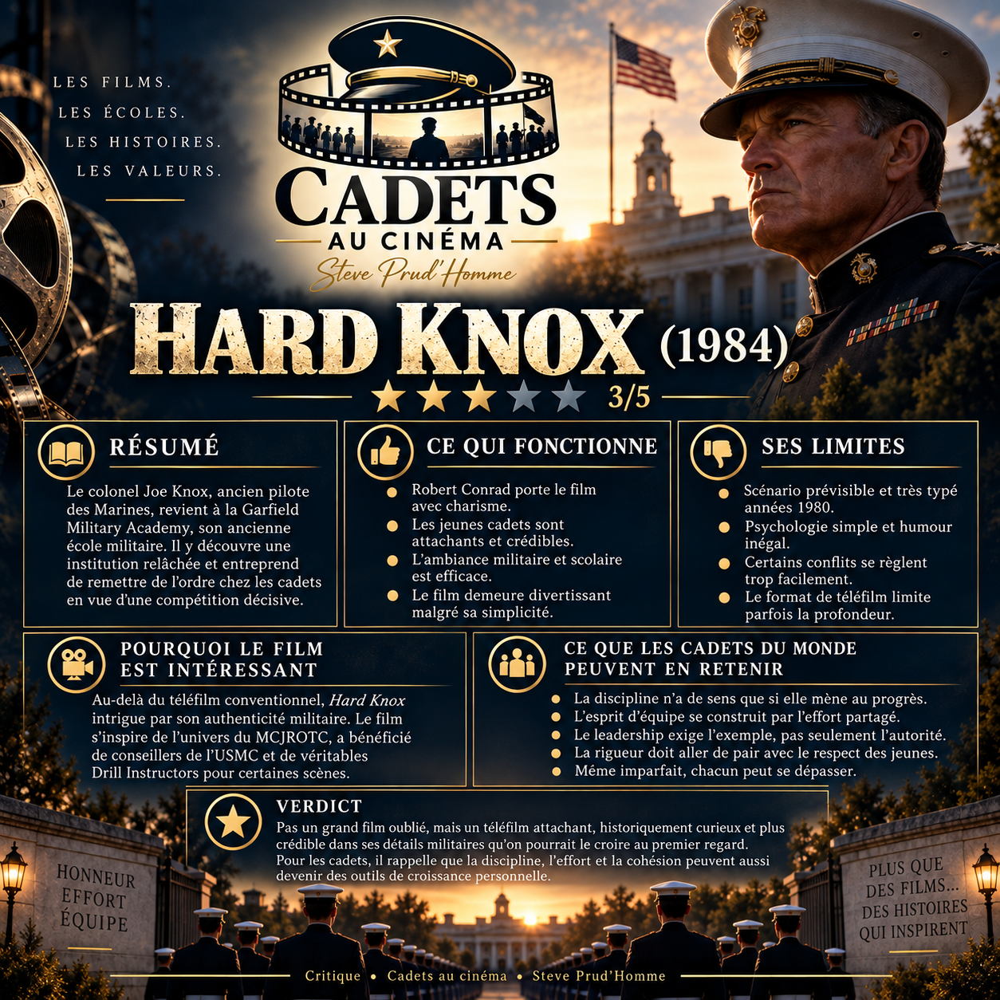

# Hard Knox (1984) — ★★★☆☆

**Une critique de Steve Prud’Homme — Cadets au cinéma**

[Retour à la notice du film](../CinemaFictionCadets.MD#film-17) · [Letterboxd](https://letterboxd.com/sprudhom/film/hard-knox/) · [SensCritique](https://www.senscritique.com/film/hard_knox/critique/345618669)

Ancien pilote de chasse des Marines, le colonel Joe Knox est forcé de quitter les airs et se retrouve à la tête de son ancienne école militaire, la Garfield Military Academy. L’établissement est en perte de vitesse, les cadets sont indisciplinés et la vieille culture militaire semble s’être sérieusement relâchée. Knox décide donc de remettre un peu d’ordre dans tout ça et de préparer les jeunes à une compétition contre une autre académie.

Soyons clairs : *Hard Knox* est un téléfilm des années 1980 et ça paraît. L’histoire est prévisible, les personnages ne sont pas très complexes et on devine assez rapidement où tout ça va nous mener. Certains conflits se règlent aussi un peu trop facilement. Le fait que le film devait servir de pilote à une série qui n’a finalement jamais été produite explique peut-être pourquoi quelques personnages et relations semblent rester en suspens.

Mais malgré tout, j’ai passé un bon moment.

Robert Conrad porte pratiquement le film à lui seul. Il a exactement la présence qu’il faut pour jouer ce colonel rigide, parfois dépassé par une nouvelle génération, mais jamais complètement caricatural. Red West est également très naturel dans le rôle de Top Tuttle. Et c’est assez amusant de voir de très jeunes Alan Ruck, Casey Siemaszko et Ricky Paull Goldin parmi les cadets.

Ce qui m’a surtout intéressé, par contre, c’est tout le côté « cadets ».

Garfield est évidemment une école fictive et le film n’est pas un documentaire sur les military academies américaines. Mais la production a travaillé avec le U.S. Marine Corps. Une conseillère militaire des Marines était présente, les uniformes et certains éléments de l’école s’inspiraient du Marine Corps JROTC et de vrais Drill Instructors ont même entraîné les jeunes figurants pour les scènes de drill.

Et ça se voit.

Pas nécessairement dans toute l’histoire, qui reste très hollywoodienne, mais dans plein de petits détails : les formations, certaines commandes, les uniformes, la façon dont les cadets sont encadrés, etc.

Mais au-delà de l’authenticité militaire, je pense que le film peut aussi être intéressant pour les cadets d’aujourd’hui, peu importe leur pays ou leur organisation.

La première leçon est assez simple : **la discipline n’est utile que si elle permet de progresser**. Knox commence par imposer l’ordre presque comme une fin en soi, mais le groupe ne devient véritablement meilleur que lorsque la discipline commence à créer de la confiance et de la cohésion.

Le film montre aussi que **l’esprit d’équipe ne se décrète pas**. Il se construit dans l’effort, dans les erreurs et dans le fait d’apprendre à dépendre des autres.

Même chose pour le leadership. Porter un grade ou donner des ordres ne suffit pas. Knox est le personnage en position d’autorité, mais il doit lui aussi apprendre. Pour moi, c’est probablement l’une des idées les plus intéressantes du film : **un bon leader doit être capable de se remettre en question**.

Et puis il y a quelque chose de très cadet dans cette idée que chacun arrive avec ses défauts, ses insécurités ou son manque d’expérience, mais peut quand même progresser lorsqu’on lui donne une responsabilité et qu’on attend quelque chose de lui.

C’est probablement ce qui fait que le film m’intéresse davantage aujourd’hui qu’il n’intéresserait le cinéphile moyen. Derrière cette histoire assez conventionnelle de jeunes indisciplinés qu’un vieux militaire remet sur les rails, il y a aussi une petite photographie de la manière dont le Marine Corps et le JROTC voulaient être représentés à la télévision américaine au début des années 1980.

Ce n’est certainement pas un grand film oublié.

Mais c’est sympathique, curieux historiquement et beaucoup plus crédible dans ses détails militaires que je ne m’y attendais.

Et pour un cadet, il reste quelques idées qui vieillissent plutôt bien : **discipline, effort, cohésion, responsabilité et leadership par l’exemple**.

★★★☆☆

**Steve Prud’Homme**
